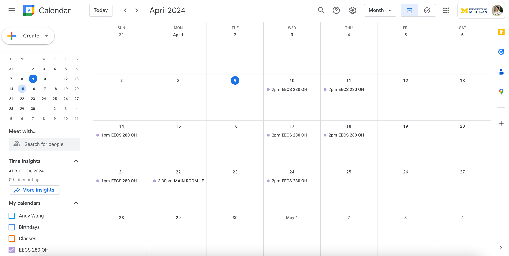
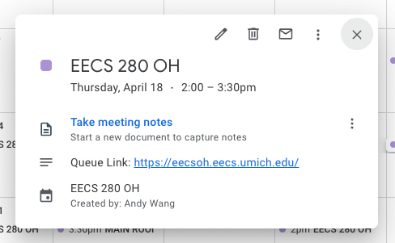

# EECS 280 Office Hours Google Sheet To Google Calender Scraper
This script uses the Google Sheets & Google Calendar API to scrape the 280 OH Scheduling spreadsheet and create Google Calender events for a configured uniqname. Distinct events are created for main room office hour sessions and regular breakout room sessions. 

## Setting up the Script: 
1. Clone this repo and `cd` into the repo
2. Activate the virtual environment: `source env/bin/activate`
3. Navigate to `config.yml` and fill out the fields specified with TODOs
4. Using your UMich Google account, follow steps 1-4 at [Create a Google Cloud Project](https://developers.google.com/workspace/guides/create-project). Once you have the project created, follow then steps 1-4 at [Enable Google Workspace APIs](https://developers.google.com/workspace/guides/enable-apis) to ensure that the Google Sheets API and Google Calendar API are both enabled for the project. 
5. [Set up your OAuth consent screen](https://developers.google.com/calendar/api/quickstart/python#configure_the_oauth_consent_screen) (just steps 1-3) and [create OAuth Credentials](https://developers.google.com/calendar/api/quickstart/python#authorize_credentials_for_a_desktop_application)(all steps). Be sure to save the downloaded credentials file
as `credentials.json`, and move it directly inside the project directory. 
6. Run: `python3 scraper.py` or `python3 main.py`. The first time the script is run, you'll need to login with your UMich email and authorize the workflow. After the script is finished running successfully, refreshing your Google Calender should show a new secondary calender named `EECS 280 OH`, with new events. You can run this script regularly by hand, or set up a cron job to sync potential changes to your OH assignments or the OH Schedule. 

## Limitations:
1. Can't distinguish between online and in-person office hours, as this information isn't readily available in the sheets

## Restarting
If you ever run into a situation during running/testing where you want to start the script anew, simply delete the secondary Calendar the script created, and delete the `gcal_file` and `gcal_id_file` specified in the `config.yml`

## Possible Future Work
1. Cron job
2. Logging & improved error handling
3. Make the code less bad?

